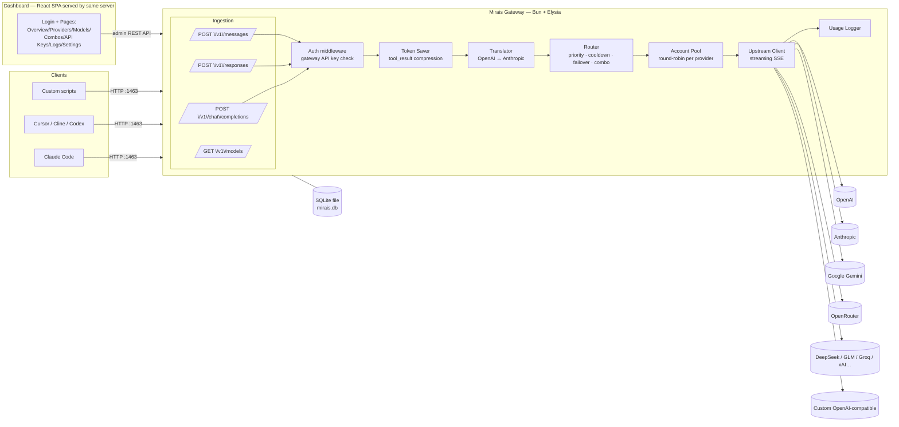

# 01 — Architecture

## 1. High-Level Overview



**Single process, single port (`1463`).** The Elysia server hosts:
1. The client-facing proxy API under `/v1/*`
2. The admin REST API under `/api/*` (session-cookie protected)
3. The static dashboard build at `/` (React SPA)
4. `/health` liveness endpoint

## 2. Request Lifecycle (chat completion)

```mermaid
sequenceDiagram
    participant C as Client
    participant G as Mirais
    participant P as Provider upstream

    C->>G: POST /v1/chat/completions (Bearer gw-key)
    G->>G: 1. Auth: validate key, check ACL/budget/rate
    alt key invalid or over limit
        G-->>C: 401 / 429 (OpenAI-style error)
    end
    G->>G: 2. Token saver: auto-compact tool results, duplicates, and stale outputs
    - The deterministic saver follows RTK-style safety: transformations fail open, never replace content with an empty/larger result, preserve recent tool results, hash-mark omitted duplicates, and bound both lines and characters. It runs on the canonical request so OpenAI Chat, Responses, and Anthropic Messages receive identical behavior.

    G->>G: 3. Normalize: parse model → provider candidates<br/>(direct model, alias, or combo)
    G->>G: 4. Translate request → upstream format (if needed)
    loop failover chain (max N attempts)
        G->>G: 5. Pick provider account (round-robin,<br/>skip cooling-down accounts)
        G->>P: Forward request (stream passthrough)
        alt success (2xx)
            P-->>G: SSE stream / JSON
            G->>G: 6. Translate response → client format
            G-->>C: Stream response
            G->>G: 7. Log usage (tokens, cost, latency)
        else retriable error (429/5xx/auth)
            G->>G: mark account cooldown, try next candidate
        end
    end
    G-->>C: Final error (all candidates exhausted)
```

### Key design rules
- **Streaming-first**: SSE is piped chunk-by-chunk; translation works on incremental events, never buffers the full body (except non-stream requests).
- **Failover only on retriable errors**: 429, 500/502/503/504, network errors, upstream auth failure (account revoked). Client errors (400) are returned as-is.
- **Cooldowns**: an account that returns 429 gets cooled down for the `Retry-After` window (default 60s); consecutive failures use exponential backoff (1m → 5m → 15m).
- **Idempotent logging**: usage is logged after the response completes (or aborts), keyed by request id.

## 3. Module Map (backend)

| Module | Responsibility |
|--------|----------------|
| `src/server.ts` | Entrypoint: build Elysia app, mount routes, serve static dashboard, listen on `PORT` (default 1463) |
| `src/config.ts` | Env parsing (`zod`-validated), paths, constants |
| `src/http/` | Route plugins: `clientRoutes` (/v1/*), `adminRoutes` (/api/*), `authRoutes` (login/logout), static serving |
| `src/auth/` | Gateway key verification (client), session cookie + password login (admin) |
| `src/translate/` | `openaiToAnthropic`, `anthropicToOpenAI`, stream event translators, model name mapping |
| `src/routing/` | Candidate resolution (model → providers), combo expansion, cooldown registry, failover executor |
| `src/accounts/` | Provider account pool, round-robin cursor, health state |
| `src/upstream/` | Fetch-based upstream client per provider type (openai, anthropic, gemini→translated, custom), SSE decode/encode |
| `src/tokensaver/` | tool_result compression rules (git diff/stat, grep, ls/tree, test output), optional terse-mode system prompt injection |
| `src/store/` | SQLite access layer (repos): providers, accounts, keys, combos, usage, logs, settings |
| `src/usage/` | Token counting (tiktoken / heuristic), cost table, aggregation queries |
| `src/shared/` | Types, errors, OpenAI/Anthropic schemas |

## 4. Translation Strategy

The gateway's internal canonical format is **OpenAI Chat Completions**.

- Anthropic request in (`/v1/messages`) → translated to canonical → routed.
- If the chosen upstream speaks Anthropic natively, canonical → Anthropic on the way out.
- Tool calls: OpenAI `tool_calls` ↔ Anthropic `tool_use` blocks, `tool` role ↔ `tool_result` blocks.
- Images: OpenAI `image_url` data-URI ↔ Anthropic `image` source blocks.
- Streaming: OpenAI `chat.completion.chunk` deltas ↔ Anthropic `message_start` / `content_block_delta` / `message_delta` / `message_stop` events.
- `max_tokens` is mandatory in Anthropic — default 4096 when absent.
- System prompt: OpenAI `system` message ↔ Anthropic top-level `system` field.

## 4.1 Model Resolution

`Router.resolve(model)` tries, in order: qualified `provider/model` → alias → combo → direct model id across providers. One nuance: when the first slash segment is **not** a known provider name, the whole string is retried as a direct model id before failing — this lets upstream ids that contain slashes (e.g. BlackBoxAI's `blackboxai/meta/llama-3.1-70b`) resolve without requiring the provider to be named `blackboxai`.

## 4.2 OAuth (ChatGPT / Codex) Upstream

Accounts added via **ChatGPT login** (`auth_kind = 'oauth'`) cannot call `api.openai.com` — OAuth access tokens are rejected there (403). They only work against the **ChatGPT Codex backend** (`https://chatgpt.com/backend-api/codex`), which speaks the **Responses API**, not Chat Completions. [src/proxy/codex.ts](../src/proxy/codex.ts) handles this path:

- **Token refresh** — access tokens are short-lived; `ensureFreshToken()` runs the `refresh_token` grant (same public client as the Codex CLI) when the token is within 5 min of expiry, and persists the new tokens.
- **Request translation** — canonical Chat Completions → Responses API: `messages` → `input` items (`input_text` / `output_text` / `input_image` / `function_call` / `function_call_output`), `system` → top-level `instructions`, `tools` → Responses function tools. `store: false` is always set.
- **Backend quirks** — the Codex backend **requires `stream: true`** and **rejects `max_output_tokens`**. Non-streaming callers therefore stream internally and aggregate the SSE events into one chat completion (`aggregateResponsesStream`).
- **Response translation** — Responses API SSE (`response.output_text.delta`, `response.output_item.added`, `response.function_call_arguments.delta`, `response.completed`) → OpenAI `chat.completion.chunk` stream, or a single aggregated chat completion.
- **Headers** — `Authorization: Bearer <access_token>` + `chatgpt-account-id: <account_id>` + `originator: codex_cli_rs`.
- **Model catalog** — synced from `GET {codex}/models?client_version=1.0.0` (the same version-gated catalog the Codex CLI uses), with a static fallback list.

## 4.3 Model Metadata & Output Limits

Each model's **context length**, **max output tokens**, and **capabilities** are stored per model (migration `0002`). They are never hardcoded per account — they follow the model's own spec:

- At **sync**, upstream-provided metadata wins; when the upstream returns none (e.g. BlackBox's `/models` only returns `{ id, object, created }`), [src/proxy/modelMeta.ts](../src/proxy/modelMeta.ts) fills the gap from a catalog keyed by **model-family name pattern** (GPT-5, Claude, Gemini, DeepSeek, Llama, Mistral, Qwen, Grok, GLM, Kimi, Nemotron, …). Image/video-generation models (veo, sora, stable-diffusion, …) have no chat context and stay `null`.
- At **request time**, the executor **clamps `max_tokens`** to the selected provider model's stored output limit (`clampMaxTokens`), falling back to the static model catalog when upstream metadata is unavailable. The clamp runs before OpenAI, Anthropic, CodeBuddy, and Codex dialect conversion, preventing upstream "max_tokens too large" errors.

## 5. Token Saver

Runs **before** translation, on the canonical request:

1. **tool_result compression** (configurable, default ON):
   - `git diff` → keep file headers + hunks, strip context lines beyond ±3
   - `grep`/`rg` → keep match lines, cap at N lines
   - `ls`/`tree` → cap depth/lines
   - Long outputs → head+tail truncation with `[... omitted X lines ...]`
   - Target: −20–40% input tokens on agentic coding traffic.
2. **Terse mode** (optional per-key or per-request flag): injects a system instruction asking for concise answers. Target: up to −50% output tokens.
3. Bypass per request with header `X-Mirais-Token-Saver: off`.

## 6. Data & State

- **SQLite** (WAL mode) at `DATA_DIR/mirais.db` — default `./data/mirais.db`.
- Cooldowns & round-robin cursors live **in memory** (rebuilt empty on restart — acceptable).
- Dashboard session = signed cookie (HMAC, secret from env), TTL 12h default.
- Nothing else leaves the machine; no telemetry.

## 7. Error Model

All client-facing errors follow OpenAI's shape:

```json
{ "error": { "message": "All providers failed for model X", "type": "server_error", "code": "all_upstreams_failed" } }
```

Admin API errors: `{ "error": "message" }` with proper HTTP status.

## 8. Security Notes

- Dashboard behind password → session cookie (`HttpOnly`, `SameSite=Lax`, `Secure` when behind HTTPS).
- Gateway API keys stored **hashed** (SHA-256 of key) — plaintext shown only once at creation.
- Constant-time key comparison.
- Rate limiting per key (requests/min, concurrency, token budget/day).
- Bind `127.0.0.1` by default; `HOST=0.0.0.0` only when explicitly exposing.
- Upstream provider secrets (API keys / OAuth tokens) stored in SQLite — recommend filesystem permissions `600` on `DATA_DIR` and full-disk encryption on servers.

## 9. Scalability & Limits (v1 scope)

- Single-process, single-instance. Bun handles thousands of concurrent SSE streams fine on modest hardware.
- SQLite is sufficient for a single user/team gateway (WAL, batched usage inserts).
- Out of scope for v1: multi-node clustering, shared state, Postgres.
