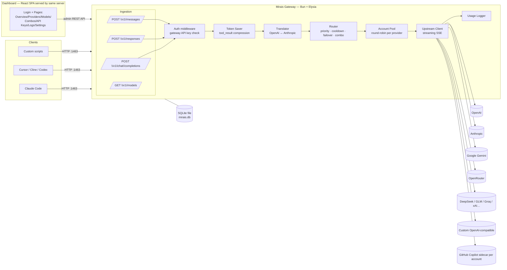

# 01 — Architecture

## 1. High-Level Overview



**Single process, single port (`1463`).** The Elysia server hosts:
1. The client-facing proxy API under `/v1/*`
2. The admin REST API under `/api/*` (session-cookie protected)
3. The static dashboard build at `/` (React SPA)
4. `/health` liveness endpoint

## 2. Request Lifecycle (chat completion)

```mermaid
sequenceDiagram
    participant C as Client
    participant G as Mirais
    participant P as Provider upstream

    C->>G: POST /v1/chat/completions (Bearer gw-key)
    G->>G: 1. Auth: validate key, check ACL/budget/rate
    alt key invalid or over limit
        G-->>C: 401 / 429 (OpenAI-style error)
    end
    G->>G: 2. Token saver: auto-compact tool results, duplicates, and stale outputs
    - The deterministic saver follows RTK-style safety: transformations fail open, never replace content with an empty/larger result, preserve recent tool results, hash-mark omitted duplicates, and bound both lines and characters. It runs on the canonical request so OpenAI Chat, Responses, and Anthropic Messages receive identical behavior.

    G->>G: 3. Normalize: parse model → provider candidates<br/>(direct model, alias, or combo)
    G->>G: 4. Translate request → upstream format (if needed)
    loop failover chain (max N attempts)
        G->>G: 5. Pick provider account (priority or round-robin;<br/>skip reauth-required and model-cooled accounts)
        G->>P: Forward request (stream passthrough)
        alt success (2xx)
            P-->>G: SSE stream / JSON
            G->>G: 6. Translate response → client format
            G-->>C: Stream response
            G->>G: 7. Log usage (tokens, cost, latency)
        else retriable error (429/5xx/auth)
            G->>G: mark account cooldown, try next candidate
        end
    end
    G-->>C: Final error (all candidates exhausted)
```

### Key design rules
- **Streaming-first**: SSE is piped chunk-by-chunk; translation works on incremental events, never buffers the full body (except non-stream requests).
- **Failover only on retriable errors**: 429, 500/502/503/504, network errors, upstream auth failure (account revoked), and SSE streams that end before producing output. Client errors are returned as-is except `413` on Combo routes: the rejecting model is skipped because another model may accept the same context size. Once output is forwarded, the request is never retried.
- **Cooldowns**: retriable failures create an in-memory attempt cooldown. Model-scoped 429 windows are also persisted per account/model so a restart does not immediately retry an exhausted model; expired cooldowns are swept every minute.
- **Bounded request bodies**: client JSON bodies are limited by `REQUEST_BODY_LIMIT_MB` (default 25 MB), including bodies without a trustworthy `Content-Length`.
- **Credential-safe upstream fetches**: same-host HTTP(S) redirects are followed manually; cross-host redirects are rejected so provider credentials are never replayed to another host.
- **Idempotent logging**: usage is logged after the response completes (or aborts), keyed by request id.

## 3. Module Map (backend)

| Module | Responsibility |
|--------|----------------|
| `src/server.ts` | Entrypoint: build Elysia app, mount routes, serve static dashboard, listen on `PORT` (default 1463) |
| `src/config.ts` | Env parsing (`zod`-validated), paths, constants |
| `src/http/` | Route plugins: `clientRoutes` (/v1/*), `adminRoutes` (/api/*), `authRoutes` (login/logout), static serving |
| `src/auth.ts`, `src/admin/auth.ts` | Gateway key verification (client); optional dashboard password, session cookie, and `/api/*` guard (admin) |
| `src/translate/` | `openaiToAnthropic`, `anthropicToOpenAI`, stream event translators, model name mapping |
| `src/proxy/router.ts`, `executor.ts` | Candidate resolution, combo strategy, account selection, cooldowns, failover execution |
| `src/proxy/refresh.ts` | Per-account OAuth refresh single-flight and persisted reauthentication state |
| `src/utils/upstreamUrl.ts` | Upstream URL safety checks and credential-safe redirect following |
| `src/proxy/promptCache.ts` | Provider prompt-cache hints and cache-token usage normalization |
| `src/tokensaver/` | tool_result compression rules (git diff/stat, grep, ls/tree, test output), optional terse-mode system prompt injection |
| `src/store/` | SQLite access layer (repos): providers, accounts, keys, combos, usage, logs, settings |
| `src/usage/` | Token counting (tiktoken / heuristic), cost table, aggregation queries |
| `src/shared/` | Types, errors, OpenAI/Anthropic schemas |

## 4. Translation Strategy

The gateway's internal canonical format is **OpenAI Chat Completions**.

- Anthropic request in (`/v1/messages`) → translated to canonical → routed.
- If the chosen upstream speaks Anthropic natively, canonical → Anthropic on the way out.
- Tool calls: OpenAI `tool_calls` ↔ Anthropic `tool_use` blocks, `tool` role ↔ `tool_result` blocks.
- Images: OpenAI `image_url` data-URI ↔ Anthropic `image` source blocks.
- Streaming: OpenAI `chat.completion.chunk` deltas ↔ Anthropic `message_start` / `content_block_delta` / `message_delta` / `message_stop` events.
- `max_tokens` is mandatory in Anthropic — default 4096 when absent.
- System prompt: OpenAI `system` message ↔ Anthropic top-level `system` field.

## 4.1 Model Resolution

`Router.resolve(model)` tries, in order: qualified `provider/model` → alias → combo → direct model id across providers. One nuance: when the first slash segment is **not** a known provider name, the whole string is retried as a direct model id before failing — this lets upstream ids that contain slashes (e.g. BlackBoxAI's `blackboxai/meta/llama-3.1-70b`) resolve without requiring the provider to be named `blackboxai`.

## 4.2 OAuth (ChatGPT / Codex) Upstream

Accounts added via **ChatGPT login** (`auth_kind = 'oauth'`) cannot call `api.openai.com` — OAuth access tokens are rejected there (403). They only work against the **ChatGPT Codex backend** (`https://chatgpt.com/backend-api/codex`), which speaks the **Responses API**, not Chat Completions. [src/proxy/codex.ts](../src/proxy/codex.ts) handles this path:

- **Token refresh** — access tokens are refreshed near expiry and persisted. Refresh is single-flight per account, so concurrent callers share one operation. Permanent refresh failures persist `reauth_required`; routing skips that account until reconnection stores fresh tokens.
- **Request translation** — canonical Chat Completions → Responses API: `messages` → `input` items (`input_text` / `output_text` / `input_image` / `function_call` / `function_call_output`), `system` → top-level `instructions`, `tools` → Responses function tools. `store: false` is always set.
- **Backend quirks** — the Codex backend **requires `stream: true`** and **rejects `max_output_tokens`**. Non-streaming callers therefore stream internally and aggregate the SSE events into one chat completion (`aggregateResponsesStream`).
- **Response translation** — Responses API SSE (`response.output_text.delta`, `response.output_item.added`, `response.function_call_arguments.delta`, `response.completed`) → OpenAI `chat.completion.chunk` stream, or a single aggregated chat completion.
- **Empty-response failover** — the Codex backend can answer `200 OK` and then emit only an error event (`"Our servers are currently overloaded"`) with no content. `responsesStreamToChat()` therefore holds back the leading chunks until the first real output event and exposes a `ready` promise; the executor awaits it, so such a response fails over to the next account instead of streaming an empty assistant message. Once content is forwarded the request is never retried (no duplicate output).
- **Headers** — `Authorization: Bearer <access_token>` + `chatgpt-account-id: <account_id>` + `originator: codex_cli_rs`.
- **Model catalog** — synced from `GET {codex}/models?client_version=1.0.0` (the same version-gated catalog the Codex CLI uses), with a static fallback list.
- **Paid-plan routing** — warmup and quota checks persist the Codex usage `plan_type` on each OAuth account. Models marked as requiring Plus/Pro are eligible only for an account with a matching persisted paid tier; Free and unknown tiers are excluded (fail closed) and are never attempted as fallback.

## 4.3 GitHub Copilot Upstream

GitHub Copilot has no public OpenAI-compatible inference endpoint. Mirais includes an isolated local Node sidecar adapter per `github-copilot` account (`scripts/copilot-sidecar/`), using GitHub's official Copilot SDK and CLI. Dashboard login opens GitHub's official browser flow; Mirais never receives the GitHub password or MFA data. Each account gets its own `COPILOT_HOME`, sidecar loopback port, and `base_url`. After login, Mirais synchronizes models from the sidecar. When the SDK account listing exposes only `auto`, the adapter uses the SDK's built-in Copilot catalog so users can select explicit model IDs; GitHub validates access when the request runs. The sidecar exposes `/v1/models`, `/v1/chat/completions`, and `/v1/quota`, including OpenAI SSE translation and the SDK's live account quota snapshots. Warmup and routing use the premium-interaction snapshot when that entitlement exists, otherwise chat, then completions. An effective quota at 0% marks only that account `rate_limited`, allowing failover to another healthy account. The dashboard displays the same effective quota and reset time. Normal account priority, round-robin, cooldown, streaming, and failover apply without sharing one Copilot entitlement across accounts.

## 4.4 Model Metadata & Output Limits

Each model's **context length**, **max output tokens**, and **capabilities** are stored per model (migration `0002`). They are never hardcoded per account — they follow the model's own spec:

- At **sync**, upstream-provided metadata wins; when the upstream returns none (e.g. BlackBox's `/models` only returns `{ id, object, created }`), [src/proxy/modelMeta.ts](../src/proxy/modelMeta.ts) fills the gap from a catalog keyed by **model-family name pattern** (GPT-5, Claude, Gemini, DeepSeek, Llama, Mistral, Qwen, Grok, GLM, Kimi, Nemotron, …). Image/video-generation models (veo, sora, stable-diffusion, …) have no chat context and stay `null`.
- At **request time**, the executor **clamps `max_tokens`** to the selected provider model's stored output limit (`clampMaxTokens`), falling back to the static model catalog when upstream metadata is unavailable. The clamp runs before OpenAI, Anthropic, CodeBuddy, and Codex dialect conversion, preventing upstream "max_tokens too large" errors.

## 4.5 Provider Prompt Caching

For sufficiently large stable prefixes, Mirais adds advisory provider-native cache hints: Anthropic `cache_control` breakpoints and an OpenAI `prompt_cache_key` derived from the session ID or stable prompt prefix. Providers that ignore these fields behave unchanged. Every upstream dialect routes its `usage` object through `normalizeUsage()`, so cache reads and writes are normalized as `cached_tokens` and `cache_write_tokens` no matter which path served the request (Chat Completions, Responses, Codex, xAI, or Anthropic), then stored with request logs and surfaced on the Usage page. Absent fields stay `null`, keeping "provider does not report caching" distinguishable from "nothing was cached".

## 5. Token Saver

Runs **before** translation, on the canonical request:

1. **tool_result compression** (configurable, default ON):
   - `git diff` → keep file headers + hunks, strip context lines beyond ±3
   - `grep`/`rg` → keep match lines, cap at N lines
   - `ls`/`tree` → cap depth/lines
   - Long outputs → head+tail truncation with `[... omitted X lines ...]`
   - Target: −20–40% input tokens on agentic coding traffic.
2. **Terse mode** (optional per-key or per-request flag): injects a system instruction asking for concise answers. Target: up to −50% output tokens.
3. Bypass per request with header `X-Mirais-Token-Saver: off`.

## 6. Data & State

- **SQLite** (WAL mode) at `DATA_DIR/mirais.db` — default `./data/mirais.db`.
- Round-robin cursors and short-lived attempt cooldowns live in memory. Model-scoped account cooldown windows and terminal OAuth reauthentication state are persisted in SQLite.
- Dashboard password is on by default (`12345678` until changed) and can be turned off: `Bun.password` hash in `settings`, plus a random `session_secret`. Session = HMAC-signed cookie keyed by `secret + password hash`, so changing the password revokes every session. Lifetime is configurable (`dashboard_session_hours`, default `SESSION_TTL_HOURS`), 30 days with "remember". It never applies to `/v1/*`.
- Nothing else leaves the machine; no telemetry.

## 7. Error Model

All client-facing errors follow OpenAI's shape:

```json
{ "error": { "message": "All providers failed for model X", "type": "server_error", "code": "all_upstreams_failed" } }
```

Admin API errors: `{ "error": "message" }` with proper HTTP status.

## 8. Security Notes

- Dashboard behind password → session cookie (`HttpOnly`, `SameSite=Lax`, `Secure` when behind HTTPS).
- Gateway API keys stored **plaintext** (single-user local install, recoverable) — legacy `key_hash` column kept for lookup fallback.
- Constant-time key comparison.
- Rate limiting per key (requests/min, concurrency, token budget/day).
- Bind `127.0.0.1` by default; `HOST=0.0.0.0` only when explicitly exposing.
- Upstream provider secrets (API keys / OAuth tokens) stored in SQLite — recommend filesystem permissions `600` on `DATA_DIR` and full-disk encryption on servers.

## 9. Scalability & Limits (v1 scope)

- Single-process, single-instance. Bun handles thousands of concurrent SSE streams fine on modest hardware.
- SQLite is sufficient for a single user/team gateway (WAL, batched usage inserts).
- Out of scope for v1: multi-node clustering, shared state, Postgres.
